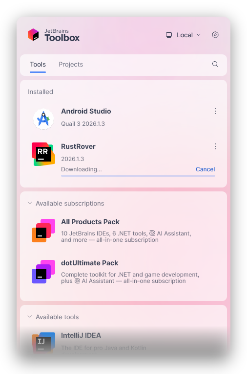
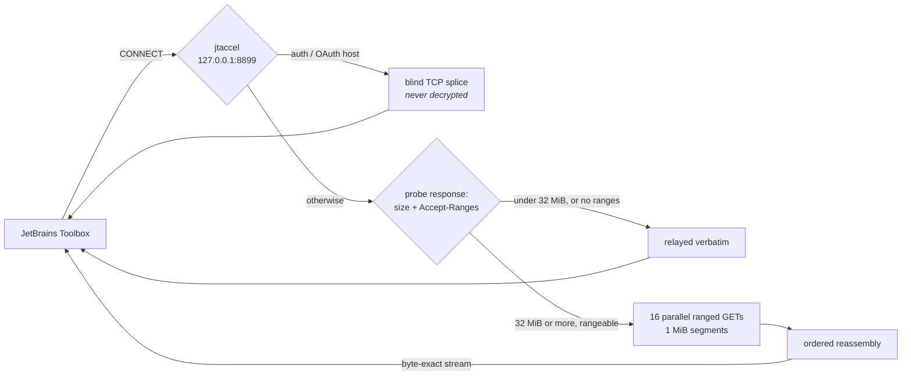
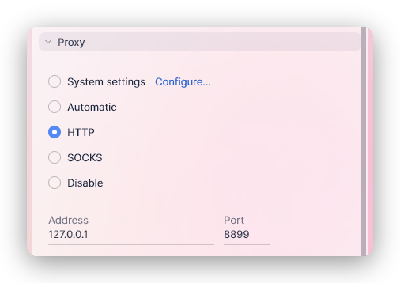
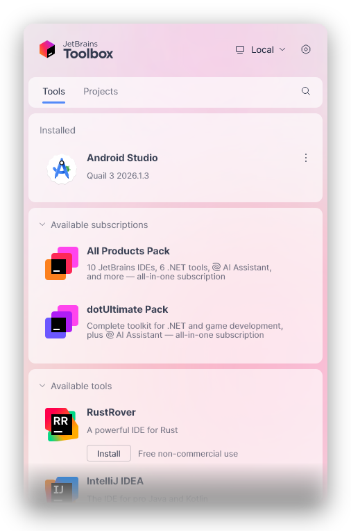

<div align="center">

<picture>
  <source media="(prefers-color-scheme: dark)" srcset="docs/hero-dark.svg">
  <source media="(prefers-color-scheme: light)" srcset="docs/hero-light.svg">
  
</picture>

<p>
  <a href="https://github.com/App-Builders-Gang/jetbrains-toolbox-accelerator/actions/workflows/ci.yml"></a>
  <a href="https://github.com/App-Builders-Gang/jetbrains-toolbox-accelerator/releases/latest"></a>
  <a href="https://github.com/App-Builders-Gang/jetbrains-toolbox-accelerator/releases"></a>
  <a href="LICENSE"></a>
  
  <a href="go.mod"></a>
  <a href="https://github.com/App-Builders-Gang/jetbrains-toolbox-accelerator/stargazers"></a>
</p>

<p><b>
<a href="#install-jtaccel">Install</a> ·
<a href="#why-is-jetbrains-toolbox-so-slow-to-download">Why Toolbox is slow</a> ·
<a href="#how-jtaccel-works">How it works</a> ·
<a href="#benchmarks">Benchmarks</a> ·
<a href="#faq">FAQ</a>
</b></p>

</div>

---

# jtaccel — fix slow JetBrains Toolbox downloads

**JetBrains Toolbox downloads every IDE over a single TCP connection.** On a lossy
long-haul path — most home lines, most of the world outside a JetBrains PoP — that one
stream settles far below the bandwidth you actually pay for. At the rates measured below,
a 1 GB IDE bundle takes about **11 minutes** instead of **2** on the very same line.

`jtaccel` is a small local proxy that splits each large Toolbox download into
**16 parallel ranged requests** and reassembles them **byte-for-byte**, so Toolbox's own
SHA-256 verification still passes. Measured on one line: **1.5 MB/s → 8.5 MB/s (≈5.7×)**.

> [!NOTE]
> Works for **every** Toolbox download — IntelliJ IDEA, Android Studio, PyCharm, WebStorm,
> GoLand, Rider, CLion, RustRover, DataGrip, plugins and IDE patches — on any CDN, at any
> file size. Windows · macOS · Linux. Single static binary, no admin, no root, fully
> reversible.

<table>
<tr>
<td width="42%" valign="top">

</td>
<td width="58%" valign="top">

### The screen you are tired of looking at

This is real Toolbox, mid-download. There is no speed readout, no connection count,
no knob — just a progress bar that moves at whatever a single TCP stream can manage.

`jtaccel` does not change this screen. It changes how long you sit in front of it.

Toolbox never knows it is there. It simply points at an HTTP proxy on `127.0.0.1`,
receives the same bytes in the same order, and verifies the same checksum at the end.

</td>
</tr>
</table>

---

## Install jtaccel

**macOS / Linux**

```sh
curl -fsSL https://github.com/App-Builders-Gang/jetbrains-toolbox-accelerator/releases/latest/download/install.sh | sh
```

**Windows** (PowerShell)

```powershell
irm https://github.com/App-Builders-Gang/jetbrains-toolbox-accelerator/releases/latest/download/install.ps1 | iex
```

That downloads the release binary, verifies its **SHA-256** against the published
checksums, installs it to a per-user directory, and runs `jtaccel install` — which points
Toolbox at the proxy and registers a local trust store
(see [How it stays trusted](#how-it-stays-trusted)). Restart Toolbox once and every
download afterwards is accelerated.

**To update, re-run the same command. To undo everything, run `jtaccel uninstall`.**

<p align="center">
  
</p>

<details>
<summary><b>Prefer to install it manually?</b></summary>

Download the binary for your platform from the
[latest release](https://github.com/App-Builders-Gang/jetbrains-toolbox-accelerator/releases/latest),
verify it against `SHA256SUMS`, put it on your `PATH`, then run:

```sh
jtaccel install
```

There is no package to register, no service account, and nothing written outside your
own user directory.

</details>

---

## Benchmarks

<picture>
  <source media="(prefers-color-scheme: dark)" srcset="docs/benchmark-dark.svg">
  <source media="(prefers-color-scheme: light)" srcset="docs/benchmark-light.svg">
  
</picture>

| Path | Measured |
|---|---|
| Line capacity (JetBrains CloudFront) | 8.5 MB/s |
| `edgedl.me.gvt1.com` (Android Studio), **1 connection** | **2.3 MB/s** |
| `edgedl.me.gvt1.com`, 6 connections | 7.8 MB/s |
| Toolbox as it ships, end to end | 1.5 MB/s |
| **Toolbox with `jtaccel`, end to end** | **8.5 MB/s** |

Same file, same line, same evening. **Aggregate bandwidth was never the limit; a single
stream was.**

### Reproduced live

Not a synthetic benchmark — this is `jtaccel`'s own log while JetBrains Toolbox installed
a tool through it on Windows 11:

```
msg=accelerating file=Air-262.132.31.zip size="275.2 MB" segments=276 workers=16
msg=delivered    file=Air-262.132.31.zip size="275.2 MB" took=35.65s rate="7.7 MB/s"
```

275.2 MB split into 276 one-MiB segments across 16 workers, reassembled in order and
handed to Toolbox at **7.7 MB/s — about 91% of the 8.5 MB/s the line can carry**. Toolbox
verified the archive and installed it without noticing anything unusual.

You can produce the same two lines on your own machine: `jtaccel status` prints the log
path, and `jtaccel run -v` shows the decision for every response.

---

## Why is JetBrains Toolbox so slow to download?

This is the question that built the tool, and it has a specific answer.

A single TCP stream on a slightly-lossy long-haul path is governed by
[loss-based congestion control (CUBIC)](https://en.wikipedia.org/wiki/CUBIC_TCP). At the
measured **~0.24% retransmit rate** on this path, CUBIC's window collapses faster than it
recovers, so one connection crawls while several connections together fill the pipe
easily. Toolbox opens one.

### Why the usual fixes don't work

- **A JetBrains mirror or proxy setting** — Android Studio doesn't come from JetBrains.
  It comes from Google's CDN (`edgedl.me.gvt1.com`). No JetBrains-side setting can touch it.
- **Changing DNS** — that host resolved to a single anycast IP from *every* resolver
  tested (Cloudflare, Google, Quad9, OpenDNS, the ISP's own). There is no better edge to pick.
- **Pinning it to `dl.google.com` in your hosts file** — TLS rejects it. That frontend
  won't serve a certificate for the `edgedl` name.
- **Downloading the IDE manually from the website** — works once, then you've opted out of
  Toolbox updates, which is the entire reason to run Toolbox.
- **Tuning your system's TCP stack** — this genuinely helps, and it composes with jtaccel.
  But it needs admin rights and it changes behaviour for every program on the machine.

`jtaccel` works because it terminates the connection locally and re-issues the download as
many ranged requests in parallel. Toolbox is unaware; the result is identical to a normal
download, only finished sooner.

---

## How jtaccel works

<picture>
  <source media="(prefers-color-scheme: dark)" srcset="docs/architecture-dark.svg">
  <source media="(prefers-color-scheme: light)" srcset="docs/architecture-light.svg">
  
</picture>



Acceleration is chosen **per response** (`≥ 32 MiB` and `Accept-Ranges: bytes`), not per
host, so it works on any CDN JetBrains uses today or moves to tomorrow — there is no
allow-list to maintain. JetBrains account and OAuth hosts are blind-tunnelled by default:
**credential traffic is never decrypted.**

### Why the segment size matters

The proxy must hand bytes to Toolbox **in order**, so nothing is emitted until the first
segment lands — and every worker shares the same line. Large segments make the first one
take forever:

| Segment size | Time to first byte | Throughput |
|---|---|---|
| 8 MiB | ~16 s | 1.55 MB/s — *worse than no proxy* |
| **1 MiB** | **0.94 s** | **8.25 MB/s** |

1 MiB is the shipped default (`DefaultSegmentSize` in `internal/proxy/server.go`),
alongside `DefaultWorkers = 16` and a `DefaultMinParallelSize` of 32 MiB.

---

## How it stays trusted

The proxy terminates TLS, so Toolbox has to trust a local certificate authority. The
obvious approach — patching the `cacerts` bundle Toolbox ships — is a trap: **Toolbox
replaces that file on every self-update**, silently reverting the patch and leaving you
wondering why downloads got slow again.

`jtaccel` instead uses Toolbox's own first-party mechanism, the `network.keystore`
setting, which **adds** a trust store on top of Toolbox's defaults without touching them.



Together with the proxy entry, that is the **entire** footprint inside Toolbox — two keys
in `.settings.json`. Everything on the right is what `jtaccel install` writes, and it is
visible and editable in Toolbox's own UI the whole time.

- The CA lives in a per-user directory with user-only permissions.
- It is **never** installed into the OS root store — the blast radius is Toolbox alone.
- `jtaccel install` **refuses to overwrite** a proxy you or your employer already
  configured, unless you pass `--force`.
- Settings are backed up before they are written, and `jtaccel uninstall` restores them.

<br clear="right">

### Privacy

- Only large, range-capable downloads are decrypted and split.
- JetBrains authentication endpoints are tunnelled blind by default.
- **No request or response body is ever logged or persisted** — only one-line transfer
  summaries.
- Nothing is sent anywhere except to the CDN Toolbox was already talking to. There is no
  telemetry.

---

## Commands

```
jtaccel install     Configure Toolbox and start the proxy at login
jtaccel uninstall   Undo everything install did (settings, CA, autostart)
jtaccel status      Show whether proxy, autostart, CA and Toolbox config are healthy
jtaccel run         Run the proxy in the foreground (for debugging)
jtaccel version     Print version
```

Useful flags: `install --port N`, `install --force`, `install --no-start`,
`uninstall --purge`, `run -v`.

---

## Verified, not assumed

`go test ./...` runs on Ubuntu, macOS and Windows against Go 1.24 and 1.26 in CI, and
covers the guarantees that actually matter:

- **Byte-exact reassembly** of an 8 MiB object fetched as 128 ranged segments across 8
  concurrent workers — the SHA-256 matches the origin's bytes exactly, which is precisely
  what Toolbox verifies.
- Ranged and resumed requests preserved end to end.
- Small objects relayed, never split.
- The local CA mints a leaf that completes a real TLS 1.3 handshake.
- The PKCS#12 trust store round-trips and decodes under a JVM.
- Toolbox settings merges preserve unrelated keys and emit the lowercase `http` proxy type
  Toolbox requires.

---

## FAQ

### Is jtaccel safe to use?

It decrypts only large downloads from content CDNs. Authentication traffic is tunnelled
blind, nothing is logged, and the local CA is confined to Toolbox's own trust store and
never reaches the OS root store. Every change is reversible with `jtaccel uninstall`. The
whole thing is about 2,400 lines of Go you can read in an afternoon.

### Will it speed up Android Studio downloads?

Yes — and that's the case that motivated it. Android Studio comes from Google's
`edgedl.me.gvt1.com`, which is precisely where single-stream throughput was worst
(2.3 MB/s of an 8.5 MB/s line).

### Does it speed up IDE updates and plugins too?

Anything Toolbox fetches that is ≥ 32 MiB and supports `Accept-Ranges` gets split — full
IDEs, patch updates and large plugins alike. Smaller requests are relayed untouched,
because splitting them would cost more than it saves.

### Does it modify the IDEs, or Toolbox itself?



No. It changes two Toolbox *settings* (proxy and keystore) and nothing else. No binary is
patched, no file inside an IDE is touched, and Toolbox self-updates keep working — which
is exactly why the trust store goes in `network.keystore` rather than in the bundled
`cacerts` that Toolbox overwrites.

Toolbox looks and behaves identically either way; the only difference is the clock.

<br clear="right">

### Does it work behind a corporate proxy?

`jtaccel install` detects an existing proxy in Toolbox and refuses to replace it unless
you pass `--force`, so it will not cut you off your company network by surprise. Chaining
jtaccel through an upstream proxy is not supported yet.

### Why not just change my TCP congestion control instead?

You can, and it helps — switching away from CUBIC improves single-stream throughput for
everything on the machine. It also needs admin rights and affects every application.
`jtaccel` is the no-admin, per-user, per-application, reversible option, and the two
compose fine.

### Does it work if I'm not signed in to a JetBrains account?

Yes. Sign-in only affects which tools Toolbox offers you, not how they are downloaded.

### Why 16 streams and 1 MiB segments?

Six connections already recovered 7.8 MB/s of an 8.5 MB/s line, so 16 saturates that link
with room to spare on faster ones, while the reorder buffer stays capped at 128 segments
(~128 MiB) no matter how large the file is. 1 MiB is the segment size that keeps
time-to-first-byte under a second — see
[the segment-size table](#why-the-segment-size-matters). Both are constants in
`internal/proxy/server.go`.

---

## Troubleshooting

<details>
<summary><b><code>jtaccel status</code> says the proxy is not listening</b></summary>

Start it in the foreground with `jtaccel run` to see live output, or re-run the installer.
`jtaccel run -v` adds debug logging.

</details>

<details>
<summary><b>A download isn't being accelerated</b></summary>

Only responses above 32 MiB that advertise `Accept-Ranges: bytes` are split. Small files,
and hosts that refuse ranged requests, are relayed verbatim by design. `jtaccel run -v`
shows the decision for each response.

</details>

<details>
<summary><b>Windows: Toolbox can't connect, but the proxy is up</b></summary>

Smart App Control in *enforcement* mode can interfere with loopback TLS for unsigned,
unreputed binaries. It affects all local-TLS tooling, not just jtaccel, and clears as the
release binary gains reputation. Confirm with `jtaccel status`: if the proxy is listening
and Toolbox still can't reach it, this is the likely cause.

</details>

<details>
<summary><b>I want everything back exactly as it was</b></summary>

```sh
jtaccel uninstall --purge
```

That removes autostart, stops the proxy, restores the Toolbox settings backup, strips any
leftover jtaccel keys, and deletes the CA and configuration directory.

</details>

---

## Contributing

Issues and pull requests are welcome — especially measurements from other networks and
regions, which is the data this project is short of. The code is plain Go with a single
dependency outside the standard library (`go-pkcs12`, to write the trust store).

```sh
git clone https://github.com/App-Builders-Gang/jetbrains-toolbox-accelerator
cd jetbrains-toolbox-accelerator
go test ./...
go run ./cmd/jtaccel status
```

The README artwork is generated — edit `scripts/gen-assets.py` and re-run it rather than
hand-editing the SVGs in `docs/`.

---

## About the icon


The jtaccel mark is a **derivative** of the JetBrains Toolbox cube. The face geometry and
all three gradients were measured from the icon that ships with Toolbox, so the cube is
genuinely theirs; Toolbox's single white bar is replaced by three tapering parallel
streams and an acceleration chevron.

**JetBrains, the JetBrains Toolbox logo, IntelliJ IDEA, PyCharm, WebStorm, GoLand, Rider,
CLion, RustRover and DataGrip are trademarks of JetBrains s.r.o. Android Studio is a
trademark of Google LLC.** This project is independent, unofficial, and not affiliated
with, endorsed by, or sponsored by JetBrains or Google. Product names and marks are used
only to identify the software jtaccel interoperates with.

<br clear="left">

## License

[MIT](LICENSE). Do what you like with it.

<div align="center">
<br>
<b>If jtaccel saved you an hour of staring at a progress bar, a ⭐ helps other people find it.</b>
<br><br>
<a href="https://github.com/App-Builders-Gang/jetbrains-toolbox-accelerator/stargazers"></a>
</div>
