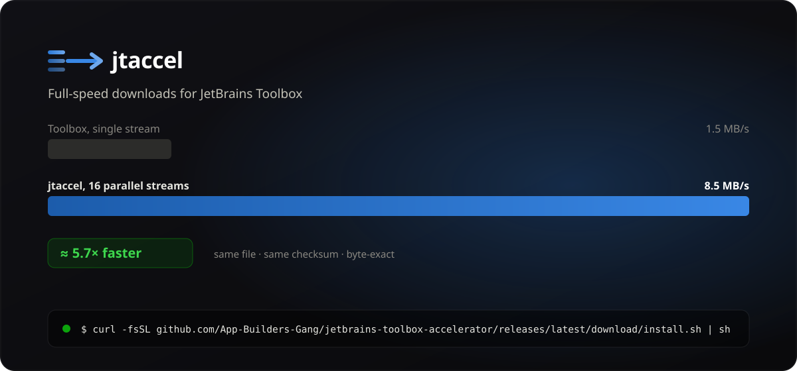
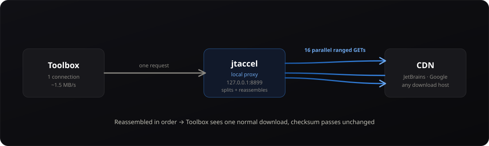

<p align="center">
  
</p>

<p align="center">
  <a href="https://github.com/App-Builders-Gang/jetbrains-toolbox-accelerator/actions/workflows/ci.yml"></a>
  <a href="https://github.com/App-Builders-Gang/jetbrains-toolbox-accelerator/releases/latest"></a>
  <a href="https://github.com/App-Builders-Gang/jetbrains-toolbox-accelerator/releases/latest"></a>
  <a href="LICENSE"></a>
  
  
  <a href="https://github.com/App-Builders-Gang/jetbrains-toolbox-accelerator/stargazers"></a>
</p>

---

# jetbrains-toolbox-accelerator (`jtaccel`)

**JetBrains Toolbox downloads tools over a single connection — and on many
home and international lines that caps out far below the bandwidth you pay for.**
`jtaccel` is a tiny local proxy that splits each large download into **16 parallel
streams** and reassembles them **byte-for-byte**, so Toolbox's own checksum
verification still passes. Measured result: **~1.5 MB/s → ~8.5 MB/s (≈5.7×)**, with
no manual steps after install.

> Works for **every** Toolbox download — IntelliJ IDEA, Android Studio, WebStorm,
> PyCharm, Rider, GoLand, plugins — any host, any file size. Windows · macOS · Linux.
> No admin / no root. Single static binary.

## Install

**macOS / Linux**

```sh
curl -fsSL https://github.com/App-Builders-Gang/jetbrains-toolbox-accelerator/releases/latest/download/install.sh | sh
```

**Windows** (PowerShell)

```powershell
irm https://github.com/App-Builders-Gang/jetbrains-toolbox-accelerator/releases/latest/download/install.ps1 | iex
```

That downloads the binary, verifies its **SHA-256** against the published checksums,
installs it, and runs `jtaccel install` — which points Toolbox at the proxy and
registers a local trust store (see [How it stays trusted](#how-it-stays-trusted)).
Restart Toolbox once and downloads are accelerated. **To update, re-run the same
command.**

## How it works

<p align="center">
  
</p>

```
Toolbox ──CONNECT──► jtaccel (127.0.0.1:8899)
                         │
                         ├── auth host? ──► blind TCP splice, never decrypted
                         └── otherwise ──► terminate TLS with a local cert
                                 └─ probe: size + Accept-Ranges
                                     ├─ large + rangeable ─► 16 parallel ranged GETs
                                     │                        └─ ordered reassembly ─► Toolbox
                                     └─ otherwise ─────────► relayed verbatim
```

Acceleration is chosen **per response** (≥32 MiB + `Accept-Ranges`), so it works for
any current or future CDN with no allow-list to maintain. JetBrains account / OAuth
hosts are blind-tunneled by default — credential traffic is **never** decrypted.

## Why is JetBrains Toolbox so slow to download?

This is the question that built the tool. Three things are true at once, and most of
the obvious "fixes" don't work:

| Path | Measured |
|---|---|
| Line capacity (JetBrains CloudFront) | 8.5 MB/s |
| `edgedl.me.gvt1.com` (Android Studio), **1 connection** | **2.3 MB/s** |
| `edgedl.me.gvt1.com`, 6 connections | 7.8 MB/s |

**Aggregate bandwidth is fine; a single stream is not.** The cause is
[loss-based congestion control (CUBIC)](https://en.wikipedia.org/wiki/CUBIC_TCP)
collapsing its window on a slightly-lossy long-haul path — at a measured ~0.24%
retransmit rate the window never recovers and one stream crawls, while several
streams together fill the pipe.

**What doesn't work** (and why):

- **A JetBrains mirror / proxy setting** — Android Studio comes from Google's CDN
  (`edgedl.me.gvt1.com`), not JetBrains'. A JetBrains-side setting can't touch it.
- **Changing DNS** — that host is a single anycast IP from *every* resolver tested
  (Cloudflare, Google, Quad9, OpenDNS, ISP). There is no better edge to pick.
- **Pinning it to `dl.google.com` via the hosts file** — TLS rejects it: that
  frontend won't serve a certificate for the `edgedl` name.

`jtaccel` works because it terminates the connection locally and re-issues the
download as many ranged requests in parallel. Toolbox is unaware; the result is
identical to a normal download.

### Why the segment size matters

The proxy must write bytes to Toolbox **in order**, so nothing is emitted until the
first segment arrives — and bandwidth is shared across all workers. Measured on an
8.5 MB/s line:

| Segment size | Time-to-first-byte | Throughput |
|---|---|---|
| 8 MiB | ~16 s | 1.55 MB/s (worse than no proxy) |
| **1 MiB** | **0.94 s** | **8.25 MB/s** |

The default is 1 MiB, and the unit test `TestAcceleratedTransferIsByteExact` guards it.

## How it stays trusted

The proxy intercepts TLS, so it needs Toolbox to trust a local certificate authority.
Rather than patching Toolbox's bundled `cacerts` (which Toolbox **replaces on every
self-update**, silently reverting any patch), `jtaccel` uses Toolbox's own first-party
mechanism: the `network.keystore` setting, which **adds** a trust store to Toolbox's
defaults without touching them.

- The CA lives in a per-user directory with user-only permissions.
- It is **never** installed into the OS root store — blast radius is Toolbox alone.
- `jtaccel uninstall` removes it and restores the original settings.

## Commands

```
jtaccel install     Configure Toolbox and start the proxy at login
jtaccel uninstall   Undo everything install did (settings, CA, autostart)
jtaccel status      Show whether the proxy, autostart, CA and Toolbox config are healthy
jtaccel run         Run the proxy in the foreground (for debugging)
jtaccel version     Print version
```

## Privacy

- Only large, range-capable downloads are decrypted and split.
- JetBrains authentication endpoints are tunneled blind by default.
- **No body is ever logged or persisted** — only one-line transfer summaries.

## Verified, not assumed

The test suite (`go test ./...`) runs on Ubuntu, macOS and Windows in CI and covers
the guarantees that matter:

- **Byte-exact reassembly** of an 8 MiB object fetched as 128 parallel segments —
  the SHA-256 matches a sequential download, which is what Toolbox verifies.
- Ranged / resumed requests preserved end to end.
- Small objects relayed, not split.
- The local CA mints a leaf that completes a real TLS 1.3 handshake.
- The PKCS#12 trust store round-trips and decodes under a JVM.
- Toolbox settings merge preserves unrelated keys and emits the lowercase `http`
  proxy type Toolbox requires.

## FAQ

**Is jtaccel safe?** It only decrypts large downloads from CDNs; authentication
traffic is tunneled blind, nothing is logged, and the local CA is confined to
Toolbox's own trust store (never the OS). Everything is reversible with
`jtaccel uninstall`.

**Will it speed up my IDE / Android Studio / plugin downloads?** Yes — anything
Toolbox fetches that is ≥32 MiB and supports `Accept-Ranges`, which covers IDEs,
Android Studio and large plugins.

**Does it work behind a corporate proxy?** `jtaccel install` detects an existing
proxy in Toolbox and refuses to overwrite it unless you pass `--force`.

**Why not just change my TCP settings?** You can — switching away from CUBIC helps
single-stream throughput system-wide, and it composes with jtaccel. `jtaccel` does
**not** touch system TCP settings; it's the no-admin, per-user, reversible option.

**Does it modify the IDEs themselves?** No. It only changes Toolbox's proxy and
trust-store settings. The IDEs are untouched.

## Troubleshooting

- **`jtaccel status` says the proxy is not listening** — start it with `jtaccel run`
  to see live output, or re-run the installer.
- **A download isn't accelerated** — only objects above 32 MiB that advertise
  `Accept-Ranges` are split.
- **Windows + Smart App Control (enforcement mode)** may interfere with loopback TLS
  for unsigned, unreputed binaries. If `jtaccel status` shows the proxy up but Toolbox
  can't connect, this is the likely cause; it affects all local-TLS tooling, not just
  jtaccel, and resolves as the release binary gains reputation.

## About the icon

The icon is a **derivative** of the JetBrains Toolbox mark (an isometric cube with the
signature orange→pink→purple gradient), with the plain glyph replaced by a
parallel-streams-and-arrow motif to convey *acceleration*. JetBrains and the Toolbox
logo are trademarks of JetBrains s.r.o.; this project is independent and not
affiliated with or endorsed by JetBrains.

## License

MIT. See [LICENSE](LICENSE).
